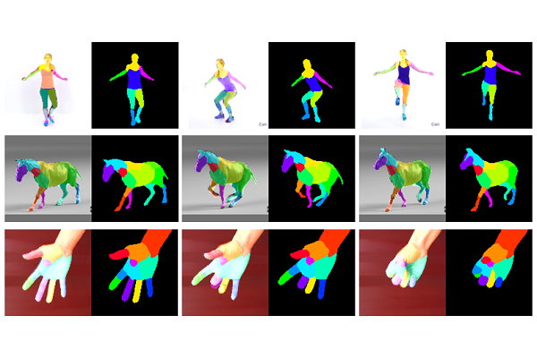

# Unsupervised Co-part Segmentation through Assembly

  

This repository contains the source code for the paper [Unsupervised Co-part Segmentation through Assembly](https://arxiv.org/abs/2106.05897) by [Qingzhe Gao](https://talegqz.github.io), [Bin Wang](https://binwangbfa.github.io), [Libin Liu](http://libliu.info), [Baoquan Chen](https://cfcs.pku.edu.cn/baoquan).

## Prerequisites

Our code has been tested on Ubuntu 18.04. Before starting, please configure your Anaconda environment by

~~~bash
conda  create -n unsup-seg python=3.6
conda activate unsup-seg 
pip install -r requirements.txt
~~~

## Training

### Datasets

**Taichi-HD and VoxCeleb**. Follow the instructions  from https://github.com/AliaksandrSiarohin/video-preprocessing.

### Run

There are two configuration files in `config` folder.  For Taichi dataset, change `config/taichi.json` to set save path and data path for training, then run:

~~~bash
CUDA_VISIBLE_DEVICES=0 python train.py --arg_file config_file/taichi.json -b 2
~~~

### Training on your own dataset

1. Resize all the videos to the same size, the videos can be in '.gif', '.mp4' or folder with images.  We recommend '.png' format for better I/O performance and loss-less.
2. Create a folder `data/dataset_name` with 2 subfolders `train` and `test`, put training videos in the `train` and testing in the `test`.
3. Create a config `config/dataset_name.json` based on `config/taichi.json` .

## Evaluation

Download pretrained models  and  evaluation data from [OneDrive](https://1drv.ms/u/s!Ahy8FQkP7rjNhshkL7TTBaDFF1uXIA?e=4mVmRn). Put model on `save_model`and evaluation data in `evaluation_data`

### Quantitative evaluation

To get quantitative evaluation, run:

~~~bash
python evaluation.py --dataset_name vox --model_path save_model/vox --data_path evaluation_data/taichi_and_vox
~~~

### Quantitative evaluation

To do segmentation on video, run:

~~~bash
python test.py --test_dir your_taichi_path/test/xxxx.mp4 --checkpoint_path save_model/taichi --out_dir result/out --part_numb 11 
~~~
### Driving static image

To Driving static image (the result need to be improved), run:

~~~bash
python driving_image.py --driving_image driving_image_path --source_image source_image_path --checkpoint_path save_model/taichi --out_dir result/driving_out --part_numb 11 
~~~

## Acknowledgements

Some code  is adapted from [first-order-model](https://github.com/AliaksandrSiarohin/first-order-model)  and [motion-cosegmentation](https://github.com/AliaksandrSiarohin/motion-cosegmentation) by @ [AliaksandrSiarohin](https://github.com/AliaksandrSiarohin)

## Citation
(to do)
If you use this code for your research, please cite our paper:

~~~bibtex
@inproceedings{Gao2021ucos,
  TITLE = {Unsupervised Co-part Segmentation through Assembly},
  AUTHOR = {Gao, Qinzhe and Wang, Bin and Liu, Libin and Chen, Baoquan },
  BOOKTITLE = {International Conference on Machine Learning},
  YEAR = {2021},
}
~~~

